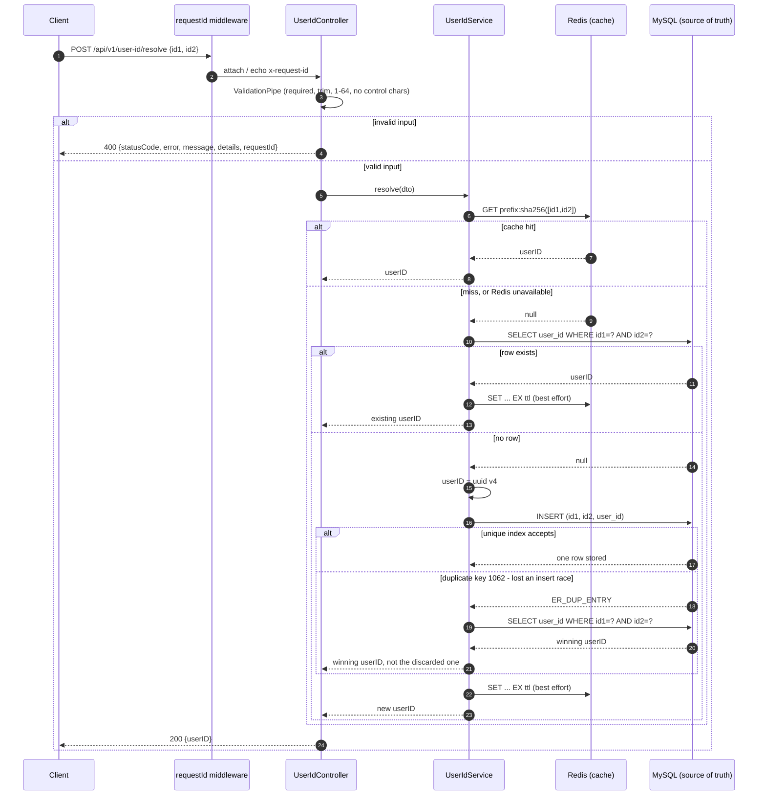

# User ID Resolution API

Backend code test for the **Digitalisation and Operations Officer (Insurtech)** role at
MediConCen Limited: a NestJS service that turns a pair of business identifiers into a stable
`userID`, backed by MySQL 8 and fronted by a Redis read-through cache.

---

## Project overview

`POST /api/v1/user-id/resolve` accepts `id1` + `id2` and returns the `userID` belonging to that
pair. The first time a pair is seen a UUID v4 is generated and stored; every later call for the
same pair returns the stored value, so the endpoint is idempotent and safe for a caller to retry.

| Layer | Choice | Why |
| --- | --- | --- |
| Framework | NestJS 12 (ESM, TypeScript 6) | The requested stack, kept on the CLI's defaults so the layout is the one NestJS developers expect. |
| Data access | TypeORM via `@nestjs/typeorm`, versioned migration | Proper ORM usage with a real migration file; the schema is never generated at runtime (`synchronize: false`). |
| Database | MySQL 8 | The only place the mapping is persisted. |
| Cache | Redis 7 via `ioredis` | Read-through cache for the pair lookup - see [Redis](#redis-what-it-is-used-for). |
| Validation | `class-validator` DTOs behind the global `ValidationPipe` | The request contract is declared once and enforced on every route. |
| Tests | Vitest - unit and e2e | Ships with the NestJS 12 scaffold; the e2e suite runs against real MySQL and Redis. |
| Packaging | Multi-stage Dockerfile + two compose files | One command starts the stack, one command runs the e2e suite. |

### What the service guarantees

- **One row per `(id1, id2)`**, enforced by a unique index in the database rather than by
  application logic.
- A `userID` that never changes once issued.
- **MySQL is the only source of truth.** Every request is answered correctly while Redis is down.
- **No secret is committed.** Configuration comes from the environment and is validated at startup.
- Failures return one stable JSON shape and never leak a stack trace, SQL statement or host name.

---

## Prerequisites

**Docker quickstart (recommended - nothing else required)**

- Docker Desktop with the WSL2 backend on Windows, or Docker Desktop on Mac/Linux.

**Running the API on the host instead**

- Node.js 22 or newer (`npm ci` reproduces the locked dependency tree exactly)
- A MySQL 8 server and a Redis 7 server reachable from the host

---

## Installation

```bash
git clone <repository-url> mediconcen-code-test
cd mediconcen-code-test
cp .env.example .env      # then edit .env
npm ci
```

`.env` is in `.gitignore` and is never committed; `.env.example` lists every variable the
application reads.

---

## Environment and configuration

`src/config/env.validation.ts` validates the environment with `class-validator` **before** the
application starts, so a missing or malformed value fails fast with a readable list of problems
instead of surfacing later as a runtime error.

| Variable | Default | Purpose |
| --- | --- | --- |
| `NODE_ENV` | `development` | `development`, `test` or `production`. |
| `APP_PORT` | `3000` | HTTP listen port. |
| `LOG_LEVEL` | `log` | Intended logger verbosity. |
| `MYSQL_HOST` | – | MySQL host. |
| `MYSQL_PORT` | `3306` | MySQL port. |
| `MYSQL_USER` | – | Application database user (see [least privilege](#security-notes)). |
| `MYSQL_PASSWORD` | – | That user's password. Never committed. |
| `MYSQL_DATABASE` | – | Schema holding `user_id_mappings`; created by you or by compose. |
| `MYSQL_POOL_SIZE` | `10` | Pool ceiling, passed to mysql2 as `connectionLimit`. |
| `MYSQL_LOGGING` | `false` | When `true`, logs SQL errors, warnings and migrations. |
| `MYSQL_ROOT_PASSWORD` | – | **Only** used by `docker-compose.yml` to provision its own MySQL container; the application never reads it. |
| `REDIS_HOST` / `REDIS_PORT` | – / `6379` | Redis endpoint. |
| `REDIS_PASSWORD` | *(empty)* | Leave empty when Redis has no password. |
| `USER_ID_CACHE_TTL_SECONDS` | `3600` | How long a cached mapping lives. `0` disables caching entirely. |
| `USER_ID_CACHE_KEY_PREFIX` | `v1:user-id-mapping` | Key namespace, so several environments can share one Redis. |

---

## Database setup

Under Docker there is nothing to run by hand: the compose file creates the schema and the
application applies the migration on boot.

Outside Docker, create the schema once:

```sql
CREATE DATABASE IF NOT EXISTS mediconcen_code_test
  CHARACTER SET utf8mb4 COLLATE utf8mb4_0900_ai_ci;
```

then start the API - TypeORM applies `src/migrations/1790438400000-CreateUserIdMappings.ts` and
records it in its own `migrations` table. The resulting table:

```sql
CREATE TABLE `user_id_mappings` (
  `id`         BIGINT UNSIGNED NOT NULL AUTO_INCREMENT,
  `id1`        VARCHAR(64) CHARACTER SET utf8mb4 COLLATE utf8mb4_0900_bin NOT NULL,
  `id2`        VARCHAR(64) CHARACTER SET utf8mb4 COLLATE utf8mb4_0900_bin NOT NULL,
  `user_id`    CHAR(36) CHARACTER SET ascii COLLATE ascii_bin NOT NULL,
  `created_at` DATETIME(3) NOT NULL DEFAULT CURRENT_TIMESTAMP(3),
  `updated_at` DATETIME(3) NOT NULL DEFAULT CURRENT_TIMESTAMP(3) ON UPDATE CURRENT_TIMESTAMP(3),
  PRIMARY KEY (`id`),
  UNIQUE INDEX `uk_id1_id2` (`id1`, `id2`),
  UNIQUE INDEX `uk_user_id` (`user_id`)
) ENGINE = InnoDB;
```

Why each piece is there:

- **`uk_id1_id2`** is the requirement "the combination of `id1` and `id2` identifies one record",
  and it is also what makes concurrent inserts safe ([concurrency](#concurrency-handling)).
- **A surrogate `id`** keeps the row addressable if the mapping later gains columns, and keeps a
  composite key out of every secondary index.
- **`utf8mb4_0900_bin` on the identifiers**: they are opaque business keys, and a case-folding
  collation would silently merge `ABC123` with `abc123`. An e2e test asserts the two stay
  separate records.
- **`CHAR(36)` in ASCII** for `user_id`: a UUID v4 in text form is exactly 36 ASCII characters, so
  it is readable straight out of a query and the index stays narrow. `BINARY(16)` would save 20
  bytes per row at the cost of readability, which is not worth it at this table's size.
- **`DATETIME(3)`** keeps sub-second ordering, and both defaults are `CURRENT_TIMESTAMP(3)` so the
  database owns the clock.
- **UTC end to end**: MySQL starts with `--default-time-zone=+00:00` and TypeORM is configured with
  `timezone: 'Z'`, so a container's locale cannot shift a timestamp.

`migrationsRun: true` is deliberate - "start the application" stays one command, and the migrator
is idempotent so a restart re-applies nothing. To change the schema, add a class to
`src/migrations/` and list it in the `migrations` array in `src/app.module.ts`; nothing is ever
written by `synchronize`.

---

## Starting the application

### Option A - everything in Docker

```bash
docker compose up --build -d
curl -s http://localhost:3000/api/v1/ready
```

MySQL (with a named volume for its data), Redis and the API come up, and the API waits for both
dependencies to report healthy before it starts.

- Logs: `docker compose logs -f api` (or `npm run docker:logs`)
- Stop, keep data: `docker compose down`
- Stop and drop the database: `docker compose down -v`

### Option B - API on the host, dependencies in Docker

```bash
docker compose up -d mysql redis
npm run start:dev
```

Both containers publish their ports to the host, which is what `.env.example` assumes
(`MYSQL_HOST=localhost`).

---

## API endpoint and example request

### `POST /api/v1/user-id/resolve`

| | |
| --- | --- |
| Content type | `application/json` |
| Body | `id1`, `id2` - both required, 1-64 characters after trimming |
| Success | `200 OK` with `{"userID": "<uuid v4>"}`, whether the value was found or just created |
| Invalid input | `400 Bad Request`, one message per offending field |
| Server failure | `500 Internal Server Error` with a generic message |

```bash
curl -X POST http://localhost:3000/api/v1/user-id/resolve \
  -H 'content-type: application/json' \
  -d '{"id1":"ABC123","id2":"XYZ456"}'
```

```json
{ "userID": "550e8400-e29b-41d4-a716-446655440000" }
```

Repeating the call with the same pair returns the same `userID`.

An invalid request shows the shared error shape:

```json
{
  "statusCode": 400,
  "error": "Bad Request",
  "message": "id1 is required; id2 must be a string",
  "details": ["id1 is required", "id2 must be a string"],
  "requestId": "0f9c6a2e-8f0f-4a55-9a7c-1b1c0d4e5f60"
}
```

Every response carries an `x-request-id` header (a caller-supplied value is reused, otherwise a
UUID is generated). The same id appears in the error body and in that request's log line, so a
problem can be traced without exposing internals.

### Other routes

| Route | Purpose |
| --- | --- |
| `GET /api/v1/health` | MySQL and Redis status with latency. Always `200` while serving; `status` becomes `degraded` when Redis is unreachable, which is expected behaviour. |
| `GET /api/v1/ready` | Readiness for a load balancer and the container healthcheck. `503` only when MySQL is unreachable. |
| `GET /docs` | Swagger UI. |
| `GET /docs-json` | The OpenAPI 3 document. |

---

## Running tests

### Unit tests - no database needed

```bash
npm test
```

They cover the service (cache hit, stored hit, new insert, duplicate-key race, genuine database
failure), the cache with a faked Redis client (fail-fast settings, hashed keys, TTL jitter,
degradation, single warning per outage, shutdown), request validation, the exception filter and
log masking.

### End-to-end tests - real MySQL and Redis, in containers

```bash
npm run test:e2e:docker
```

This starts an in-memory MySQL and a Redis on a throwaway compose network, runs `npm run test:e2e`
inside the image, and exits with the suite's status. The database is empty every run, so there is
nothing to clean up.

To run the same suites against your own MySQL and Redis:

```bash
npm run test:e2e
```

> **Warning:** the e2e files `TRUNCATE` `user_id_mappings` and flush the cache between cases.
> Point `MYSQL_DATABASE` in `.env` at a disposable schema - never at data you care about.

| File | Proves |
| --- | --- |
| `test/user-id.e2e-spec.ts` | The contract: generation, idempotence, persistence, the warm cache entry, case-sensitive pairs, every 400 case, error shape, request-id reuse, health and readiness. |
| `test/concurrency.e2e-spec.ts` | 30 simultaneous requests for one unseen pair produce **one row and one `userID`**, and 30 different pairs stay distinct. |
| `test/redis-outage.e2e-spec.ts` | With Redis pointed at a closed port, requests still succeed and repeat correctly, `/health` reports `degraded`, and `/ready` stays `200`. |

Coverage: `npm run test:cov`. Lint: `npm run lint`. Formatting: `npm run format`.

---

## Redis: what it is used for

Redis is a **read-through cache** for the `(id1, id2) -> userID` lookup
(`src/modules/user-id/user-id.cache.ts`). A request checks Redis first, falls back to MySQL on a
miss, and writes the confirmed value back with a TTL.

- **Why the cache can never go stale:** the mapping is immutable - a pair's `userID` is written
  once and never updated - so there is no invalidation path to get wrong. The TTL (plus up to 60
  seconds of jitter, so a warm-up batch does not expire on one tick) only bounds Redis memory.
- **Keys are `prefix:sha256(JSON[id1,id2])`**: fixed length, no separator ambiguity, and customer
  identifiers never appear verbatim in Redis.
- **Misses are not cached.** A missing pair means "create it"; caching absence would only add a
  window in which a legitimate request is delayed.
- **An outage costs latency and nothing else.** Every Redis call is wrapped so it cannot reject or
  block: `enableOfflineQueue: false`, `commandTimeout: 250ms`, `connectTimeout: 500ms`,
  `maxRetriesPerRequest: 1`. While the client is not reporting `ready`, reads return `null` and
  writes are skipped. Failures are logged **once per outage**, not once per command.
- **An `error` listener is attached to the client.** Without one, ioredis re-emits connection
  failures as unhandled errors and would take the process down - this is where the requirement
  "unexpected application/database errors do not cause uncontrolled crashes" is met for the cache.
- **Redis is not the record store.** `docker-compose.yml` starts it with `--save "" --appendonly
  no`, so a restart empties the cache and MySQL remains the only persisted state.
  `USER_ID_CACHE_TTL_SECONDS=0` turns caching off with no code change.

---

## Concurrency handling

Two requests carrying the same unseen pair can arrive together, both find nothing, and both try
to insert. The database is the arbiter (`UserIdService.resolve`):

1. `INSERT` the new row.
2. If the driver rejects it with MySQL error **1062 / `ER_DUP_ENTRY`**, the unique index has just
   declared another request the winner.
3. **Re-read the pair** and return the `userID` that is actually stored; the generated-but-unstored
   UUID is discarded and the log records that the race was lost.
4. If that re-read finds nothing, the original error propagates - it is no longer a race but a real
   inconsistency.
5. Either way the caller gets `200` with one consistent `userID`, and exactly one row exists.

Deliberate choices:

- **No Redis lock, and no `INSERT ... ON DUPLICATE KEY UPDATE`.** An application-level lock is only
  advisory: it does not survive a Redis outage, a lost lease or a second API instance, and it would
  still need the unique index behind it. Because the index already decides the winner, a lock would
  only move work around. An upsert is the other sound option; the plain insert plus re-read was
  chosen because it keeps "return the stored value" as an explicit, testable step.
- **No retry loop.** One re-read suffices: the winner's row is committed by the time the loser sees
  the rejection.
- **Correctness is asserted, not assumed** - `test/concurrency.e2e-spec.ts` fires 30 parallel
  requests over a real HTTP listener (supertest would serialise them through one socket) and checks
  for one row and one shared `userID`.
- `uk_user_id` additionally guarantees no two pairs can ever be issued the same `userID`.

---

## Sequence diagram



---

## Assumptions and technical decisions

**Scope**

1. **No authentication.** The brief describes an internal backend service and specifies no
   credential model, so the API is unauthenticated and assumed to sit behind a gateway. A real
   deployment would add an API key or mTLS here.
2. **No rate limiting or idempotency keys**: the pair is the key, so a retried request is already
   safe.
3. **`id1` / `id2` are opaque identifiers**, at most 64 characters, stored verbatim apart from
   surrounding whitespace.

**API contract**

4. **`200 OK` for both outcomes** rather than NestJS's default `201 Created`. This is a
   lookup-or-create keyed on a pair the caller already owns, so the resource is not "created by
   this request" in the REST sense; one status keeps clients simple. Returning `201` on creation
   would be a one-line change (`@HttpCode`) if the consumer prefers it.
5. **The response body is exactly `{"userID": ...}`**, matching the brief's spelling and
   capitalisation. The column and entity property are `user_id` / `userId`; the response DTO is the
   single place the contract spelling is applied, which keeps the rest of the codebase in normal
   camelCase.
6. **Validation is strict about required fields and length, deliberately lenient about characters.**
   Only control characters are rejected. Identifiers arrive from other insurers' systems and may
   contain spaces, hyphens or Chinese characters, so a whitelist such as `^[A-Za-z0-9]+$` would
   silently reject valid business data. Unknown extra properties *are* rejected
   (`forbidNonWhitelisted`), because the request contract is documented.
7. **Values are trimmed before validation**, so `"  ABC123  "` and `"ABC123"` resolve to one pair
   instead of two records for one business key.

**Storage**

8. **Identifiers are case-sensitive** (`utf8mb4_0900_bin`). This is the conservative reading of
   "the combination identifies one record". If the business later decides these numbers are
   case-insensitive, the collation changes in a migration and the API contract does not move.
9. **UUID v4 from `node:crypto.randomUUID()`** - RFC 4122 version 4, drawn from the OS CSPRNG, and
   no extra dependency for it.
10. **No soft delete and no history table.** The brief describes a permanent mapping, so a row *is*
    the record; `created_at` / `updated_at` cover operational questions.

**Operations**

11. **Business identifiers are masked in logs** (`POL************123`). They are traceable-to-customer
    values in combination with other systems, and masking costs nothing. Full values stay in MySQL,
    the only place they need to be readable.
12. **Migrations run at boot** so this submission is one command to start (see
    [Database setup](#database-setup)).
13. **`/docs` stays enabled in every environment** because a reviewer is expected to run the
    container and reach it; in a real deployment it would be restricted to internal traffic.
14. **Toolchain:** the NestJS 12 CLI defaults were kept - ESM output, Vitest rather than Jest,
    oxlint rather than ESLint, Prettier for formatting, `strict` TypeScript with
    `strictPropertyInitialization: false` (DTO and entity properties are populated by the
    framework, not by a constructor).
15. **Unused scaffold pieces were removed** rather than left behind: the demo controller, its tests,
    and the `@nestjs/mau` deploy tooling. `npm audit` reports no vulnerabilities, and production
    dependencies alone are also clean.

---

## Project layout

```text
src/
  main.ts                     bootstrap only
  configure-app.ts            pipes, filters, interceptors, prefix, Swagger - shared by main and e2e
  app.module.ts               module wiring and the TypeORM data source
  config/
    env.validation.ts         environment schema; startup fails fast on a bad value
    swagger.ts                OpenAPI document
  common/
    database/typeorm-error.util.ts     recognises MySQL 1062 inside TypeORM's wrapper
    filters/all-exceptions.filter.ts   one error shape, no internal leakage
    interceptors/ + logging/           access-log lines carrying the request id
    middleware/                        x-request-id propagation
    types/express.d.ts                 typing for that request id
    util/mask.util.ts                  masking for logs
  migrations/
    1790438400000-CreateUserIdMappings.ts
  modules/user-id/
    user-id.controller.ts     route, status code, response DTO
    user-id.service.ts        lookup-or-create and the duplicate-key race handler
    user-id.cache.ts          Redis read-through cache that never rejects
    user-id.module.ts         feature module
    user-id.constants.ts      shared limits
    dto/                      request and response contracts (validated, documented)
    entities/                 the single table
  health/                     status and readiness
test/                         e2e suites: contract, concurrency, Redis outage
Dockerfile                    deps -> build -> test / runtime stages
docker-compose.yml            api + mysql + redis for development
docker-compose.test.yml       the same, arranged for one e2e run
.env.example                  every variable, with no real values
```

---

## Security notes

- **No secret is committed.** `.env` is ignored and only `.env.example` is tracked, with
  placeholders. The compose files take their values from `.env`, and the MySQL healthcheck reads
  its password inside the container (`$$MYSQL_ROOT_PASSWORD`) instead of interpolating it into the
  file.
- **Least privilege**: the application connects as `MYSQL_USER`, not `root`. That user needs DML on
  `user_id_mappings` plus the TypeORM `migrations` table. The root password is only used by
  `docker-compose.yml` to provision the container, and is never read by the application.
- **Error responses** carry a generic message for anything unexpected; the driver message and stack
  trace go to the server log under the request id.
- **No SQL string interpolation**: parameter binding throughout, and the only raw SQL is the fixed
  DDL in the migration.
- The e2e compose file contains throwaway credentials for an in-memory database that publishes no
  host port - they are test scaffolding, not secrets.
